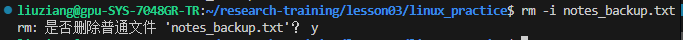

# lesson03

# **实验报告：Linux 环境配置与深度学习模型 SASRec 部署测试**


**实验课程**：Lesson03  

**实验日期**：2026\-07\-15 \~ 2026\-07\-16  

**实验人员**：liuziang  

**实验环境**：学校 GPU 服务器（NVIDIA GeForce RTX 3090 × 3），操作系统 Linux，Conda 环境

---
## 一、实验目的

1. 熟悉 Linux 基本命令行操作（文件管理、权限修改、内容查看等）。  

2. 掌握在远程服务器上配置 Miniconda 及镜像源。  

3. 创建独立的 Conda 虚拟环境，安装 PyTorch 等依赖。  

4. 运行 SASRec 模型模拟测试（smoke demo），验证环境有效性。  

5. 学习使用 `nvidia-smi` 监控 GPU 状态，并指定特定显卡运行程序。

---

## 二、实验内容与步骤

### 2\.1 Linux 基础操作练习
在 `~/research-training/lesson03/linux_practice/` 目录下进行了以下常用命令操作：

- **创建目录与文件**  

    ```Bash
    mkdir -p ~/research-training/lesson03/linux_practice
    cd ~/research-training/lesson03/linux_practice
    touch notes.txt
    ```

- **写入文件内容**  

    ```Bash
    printf "Linux command practice\nGPU environment check\nSASRec smoke demo\n" > notes.txt
    ```

- **查看文件内容**  

    ```Bash
    cat notes.txt
    head -n 2 notes.txt   # 显示前两行
    tail -n 2 notes.txt   # 显示后两行
    ```

- **查看目录大小与磁盘空间**  

    ```Bash
    du -sh .            # 当前目录大小 8.0K
    df -h ~             # 家目录空间使用情况（总 1.8T，已用 71%）
    ```

- **编写并执行 Shell 脚本**

创建 `hello.sh` 并赋予执行权限，成功输出 “Hello from Linux”。

```Bash
printf '#!/usr/bin/env bash\necho "Hello from Linux"\n' > hello.sh
chmod u+x hello.sh
./hello.sh
```

- **删除文件（交互式确认）**  

    ```Bash
    rm -i notes_backup.txt
    ```

    

> 以下截图展示了上述操作的终端记录：




---
### 2\.2 Miniconda 安装与配置

#### 2\.2\.1 安装 Miniconda

从官网下载安装脚本并在家目录执行：

```Bash
bash Miniconda3-latest-Linux-x86_64.sh
```

按提示接受许可，选择安装路径（默认 `~/miniconda3`），并同意初始化（`conda init`）。  

安装后执行 `source ~/.bashrc` 使配置生效，验证：

```Bash
conda --version        # 显示 conda 26.5.3
conda env list         # 显示 base 环境
```

> 安装过程截图：

#### 2\.2\.2 配置 Conda 与 Pip 镜像

为提高下载速度，配置了清华大学 TUNA 镜像源，并设置 `conda-forge` 为主频道，同时屏蔽官方 `defaults` 以规避商业许可限制。

- 查看当前配置：`conda config --show-sources`  
- 主要配置文件 `~/.condarc` 内容：
    ```YAML
    channel_priority: strict
    channels:
      - conda-forge
      - nodefaults
    custom_channels:
      conda-forge: https://mirrors.tuna.tsinghua.edu.cn/anaconda/cloud
    show_channel_urls: True
    ```

> 配置源信息截图：

#### 2\.2\.3 创建虚拟环境 `lesson03`

```Bash
conda create -n lesson03 python=3.10 -y
conda activate lesson03
```

> 注：首次创建时曾遇到 Anaconda ToS 提示，通过 `conda tos accept` 接受服务条款后解决。

---
### 2\.3 安装 NumPy 解决警告

在运行 SASRec 测试时，PyTorch 提示 `Failed to initialize NumPy`，虽不影响测试通过，但为消除警告，在 `lesson03` 环境中安装 NumPy：

```Bash
conda install -c conda-forge numpy
```

---
### 2\.4 SASRec 烟雾测试运行

#### 2\.4\.1 项目结构与测试执行

切换到项目目录：

```Bash
cd ~/research-training/lesson03/sasrec_smoke_demo
```

查看项目文件：

```Bash
find . -maxdepth 2 -type f -print
```

使用 Python 单元测试框架运行全部测试：

```Bash
python -m unittest discover -s tests -v
```

输出结果显示 **5 个测试全部通过（OK）**，耗时约 6\.5 秒。  

测试内容涵盖端到端写入、单步更新、输出形状、因果掩码、数据生成和负采样等。

> 项目文件列表与测试输出截图：


#### 2\.4\.2 检查 GPU 资源
使用 `nvidia-smi` 查看三块 RTX 3090 的状态：

- GPU 0：被其他用户进程占用（约 1\.9 GiB）  

- GPU 1：被其他用户进程占用（约 2\.2 GiB）  

- GPU 2：几乎空闲（仅系统 Xorg 占用 15 MiB，功耗 28W，温度 46°C）
因此选择 **GPU 2** 作为运行设备。
#### 2\.4\.3 运行 SASRec 训练（指定 GPU 2）
使用环境变量 `CUDA_VISIBLE_DEVICES=2` 仅暴露 GPU 2，并传入相应训练参数：

```Bash
CUDA_VISIBLE_DEVICES=2 python sasrec_demo.py \
  --device cuda \
  --epochs 10 \
  --batch-size 32 \
  --max-len 20 \
  --hidden-size 64 \
  --num-heads 2 \
  --num-blocks 2 \
  --allocator-limit-mib 700 \
  --gpu-budget-mib 1024
```
#### 2\.4\.4 运行结果与 GPU 监控
程序成功运行，输出日志显示：

- **最佳 epoch**：第 10 轮  

- **验证指标**：HR@10 = 0\.8047，NDCG@10 = 0\.6363  

- **测试指标**：HR@10 = 0\.8672，NDCG@10 = 0\.6620  

- **GPU 内存峰值**：进程占用约 342 MiB，PyTorch 分配 22 MiB，预留 28 MiB，**完全在 1024 MiB 预算内**。  

- 生成输出目录 `outputs/run_20260716_141109/`，包含模型配置与结果 JSON 文件。
同时通过 `watch -n 1 nvidia-smi -i 2` 实时监控 GPU 2 状态，确认任务正常运行（显存占用约 277 MiB，功耗 121W）。

> 运行结果 JSON 与 GPU 监控截图：


（GPU 2 显示 Python 进程占用约 254 MiB）

---

## 三、实验总结

本次实验完成了以下目标：

1. **Linux 基础操作**：熟练使用 `mkdir`, `cd`, `ls`, `cat`, `head`, `tail`, `chmod`, `rm`, `du`, `df` 等命令，并编写了简单的 Shell 脚本。
2. **环境搭建**：成功在个人家目录安装 Miniconda，配置清华镜像加速，创建独立虚拟环境，避免了依赖冲突。
3. **深度学习模型测试**：在 GPU 环境下完整运行 SASRec 烟雾测试，验证了代码、数据加载、模型训练和评估流程均正常。
4. **GPU 资源管理**：学会使用 `nvidia-smi` 查看显卡使用情况，并通过 `CUDA_VISIBLE_DEVICES` 指定显卡运行程序，合理分配计算资源。
5. **问题解决**：处理了 Conda 服务条款提示、NumPy 缺失警告，并能通过配置文件永久解决镜像问题。
---
## 四、附件说明

- **实验截图**：已全部嵌入上文对应位置，包括终端操作记录、配置文件内容、测试输出、GPU 状态等。
- **代码与输出**：所有运行日志和输出 JSON 文件保存在 `~/research-training/lesson03/sasrec_smoke_demo/outputs/` 下。

