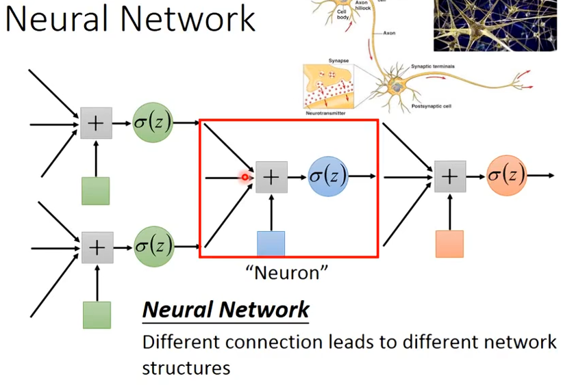

# Machine learning

学习链接：https://www\.bilibili\.com/video/BV1ruqABeEFX/?p=2\&share\_source=copy\_web\&vd\_source=c886c07c7e89f58d39a7f62f98db98c3

# 步骤：

### 1\.训练

Model的反向传播等参数更新是一个batch跑完算一次Loss，然后更新一次，所以一个epoch里可能有多次权重更新（如下图）

### 2\.验证

### 3\.测试

---
# 专有名词：

- **Regression\(回归\)**: The function outputs a scalar\.

- **Classification**: Given options\(classes\), the function outputs the correct one\.

- **Structured Learning**: Create something with structure\.

- **Model**：带有unknown parameters的function

- **Feature**: 具体数据

- **Loss**: 偏差，用于评判model好不好

- **ReLU**:Rectified Linear Unit修正线性单元，简称ReLU（Rectified Linear Unit），是一种常用的人工神经网络中的激活函数。ReLU函数的形式为： f\(x\) = max\(0,x\)。它在x大于零的时候激活，输出x；在x小于等于零的时候不激活，输出零。
---
# 重要概念：

### Backpropagation（反向传播）

### 局部最小值

### 鞍点

### batch（批次）

一大堆数据分成多个batch的时候，会进行shuffle，并且batch并非极大或极小最好

### momentum（动量）

### Gradient descent（梯度下降）

### 神经网络

1. 不同的神经元连接方式构成了不同的structure（手动设置连接方式）

2. 神经网络的操作用矩阵和向量解决，可以将一个neural network看做一个function，其中黄色是Weight，绿色是Bias，最后在通过某个function得到神经元上的数值

3. 一些名词：
	Fully connect feedforward network:每两个神经元间都进行连接
	dimension:维度

4. 除输入层和输出层，其余均为隐藏层\(hidden layer\)

