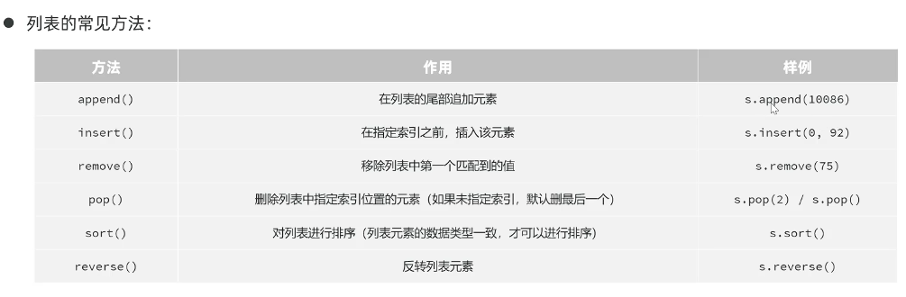

# Python

# Part 1 基本了解

### 1\.注释

代码中使用‘\#’，作注释符号

```Python
#注释符号
```

### 2\.换行

用回车键即可

# Part 2 数据存储与运算

### 1、字面量与变量

①字面量


②变量

python中一个变量可以存储不同类型的值，但一般不这样做。

③标识符

- 是程序员在代码中为变量、函数、类等元素所起的名字。

- 命名尽量update\_time

python内的关键字主要True,False,None


### 2、常见数据类型


通过type\(XX\)查看数据的类型

```Python
print(type("hello"))
```

通过isinstance\(\)检查数据是否属于指定的类型，返回一个bool值，语法isinstance\(数据，类型\)

```Python
num = 6
print(isinstance(num,int))
```

##### \(1\)字符串

1. 定义

```Python
#双引号定义
sl = "Hello"
#单引号定义
s2 = 'Python'
#三引号定义(多行字符串）
s3 = """
尊敬的客户：
感谢您选择我们公司的产品。
我们讲会为您竭诚的服务。
祝好~
"""

#若原居中含'，则使用转义字符“\”
s4 = "It\'s veliy"#（内单外双，内双外单）
```

2. 拼接

    1. 使用\+号——\>对象为字符串


    2. 字符串格式化——使用%占位符，即%s


    3. 最推荐！！！！——f字符串格式化


### 3、输入与输出

通过input语句获取输入（所有键盘录入的都是字符串类型）

通过print语句输出

```Python
#input(..）)
name=input（"请输入您的姓名："）
print(f"欢迎您，{name}"）
age=input("请输入您的年龄："）
print(f"您今年{age}岁"）
#强制转换
age_new=int(age)+18
```

### 4、运算符

其余与C\+\+几乎相同除

```Python
#幂指数
10**3 #10的三次方

#逻辑运算符
and #&&
or #||
not #！

```

# Part 3 数据的逻辑处理

### if

```Python
a = 10
b = 20 
#if内按照缩进归属代码块
if a<b:
    print("Yes")
elif a==b:
    print("Oh yeah")
else:
    print("No")
```

### match类似C\+\+中的switch\_case语句

```Python
day=input("请输入星期几(1-7):"）
match day:
    case "1":
        print("周一：工作会议日"）
    case "2":
        print（"周二：学习培训日"）
    case "3":
        print（"周三：项目开发日"）
    case "4":
        print（"周四：代码审查日"）
    case "5"：
        print("周五：总结规划日"）
    case "6" | "7"：#其中的|表示或的关系，匹配多个模式中的任意一个————或的意思
        print("周末：休息放松")
    case _:#类似default,且不需要break
        print（"输入错误")
```

### while

```Python
#.while语法结构
while 条件表达式：
    循环体语句1
    循环体语句2
    ..
else: #可有可无
```

### for

```Python
for 元素 in 待处理数据集:
    循环体
else: #可有可无

#定义要遍历的字符串，按照下标访问——用的少
msg = "Hello-Python"
#遍历字符串，并处理
for i in msg:
    print(i)
else:
    print（"循环结束"）
```

# Part 4 数据存储容器

### list

- 列表是数据容器中的一类，是一次性可以存储多个数据（元素）的。

- 定义：列表名称 ＝ \[元素1，元素2，元素3，元素4，元素5\.\.\.\]

s = \[54，15，75，108，23，78，75\]

特点:

- 可以存储不同类型的元素——\>s1 = \[54, 22, "sterr"\]

- 元素有序、可以重复、元素可以修改

- 通过下标操作

##### （1）切片


##### （2）常见方法




### str

##### \(1\) 字符串具有不可变性（不支持内部修改）

```Python
s = "hello"
s[2]="X"
#会进行报错
```

##### \(2\)  常见方法

- python中单引号（`''`）和双引号（`""`）在功能上完全等价，字符串里同时包含单引号和双引号，那使用三引号（`'''` 或 `"""`）最方便

- 另外常用方法中也不操作旧字符串，而是生成新字符串


### tuple

相比列表（元素可重复、有序、可修改），元组一旦定义完成，不可修改（但支持访问和切片）

##### （1）基本操作

```Python
#定义元组
yuan = (元素1, 元素2.........)

print(yuan.count(元素X))
print(yuan.index(X)) #第一次出现的位置
```

##### （2）组包与解包

- 组包（Packing）：将多个值合并到一个容器（元组、列表）中。

- 解包（Unpacking）：将容器\(元组、列表\)解开成独立的元素，分别赋值给多个变量。\-\-此处必须解所有值

```Python
# 1. 定义元组（组包）
t1 = (5, 7, 9, 1)          # 使用圆括号
t2 = 5, 7, 9, 1            # 省略括号（同样可以）

# 2. 基础解包（元素个数必须严格匹配）
a, b, c, d = t1
print(f"基础解包: a={a}, b={b}, c={c}, d={d}")

# 3. 扩展解包（使用 * 收集多余元素）
x, *y, z = t2               # x=5, y为列表[7,9], z=1
print(f"扩展解包1: x={x}, y={y}, z={z}")

s, *o = t2                  # s=5, o为列表[7,9,1]
print(f"扩展解包2: s={s}, o={o}")

*o, e = t2                  # o为列表[5,7,9], e=1
print(f"扩展解包3: o={o}, e={e}")

输出结果：
基础解包: a=5, b=7, c=9, d=1
扩展解包1: x=5, y=[7, 9], z=1
扩展解包2: s=5, o=[7, 9, 1]
扩展解包3: o=[5, 7, 9], e=1
```

### set

相比list，tuple，集合set会自动去重

##### （1）定义

```Python
#定义集合
s1 = {"C","D","E"......}

#定义空集合
s2 = set()
```

- 空集合的定义不可以使用\{\}，\{\}表示的是空字典

- 由于集合是无序的，因此是不支持下标索引访问的

##### （2）常用方法


### dict

##### （1）定义

- 字典：使用键值对（key：value）来存储数据，每一个键都对应一个值，通过键（key）可以快速找到对应的值（value）。

- 特点：键值对（key：value）存储、键（key）不能重复、可修改。

```Python
#定义字典
dict1 = {"王林"：670,"张紫"：678}
#查找
score = dict1["王林"]


#定义空字典
dict2 = {}
```

key不能重复\(如果重复，后面的值，会覆盖前m的值\)、key必须得是不可变类型\(str，int，float，tuple\)

##### （2）常用操作


# Part 5 函数

##### （1）函数的定义和调用：

```Python
def 函数名(参数列表)：
    函数体
    ......
    return 返回值
```

##### （2）函数的参数与返回值——return XXX
（3）函数的说明文档

通常使用三引号注释

```Python
def 函数名(参数列表)：
    """
    该函数XXXXXX
    :param r: 圆的半径
    ...
    :return: 圆的面积，圆的周长
    """
    函数体
    ......
    return 返回值
```

##### （4）传参方式

1. 位置传参

位置实参与形参一一对应

```Python
def reg_stu(name, age, gender, city):
    print(f"注册成功,姓名:{name}, 年龄:{age}, 性别:{gender}, 城市:{city}")
    return {"name": name, "age": age, "gender": gender, "city": city}
    
stu = reg_stu("张三", 18, "男", "北京")
print(stu)
```

2. 关键字传参

```Python
def reg_stu(name, age, gender, city):
    print(f"注册成功,姓名:{name}, 年龄:{age}, 性别:{gender}, 城市:{city}")
    return {"name": name, "age": age, "gender": gender, "city": city}
    
    
stu2 = reg_stu(gender="男", name="王武", city="上海", age=22)
print(stu2)
```

若需要混合使用，则位置参数不能在关键字参数之后

3. 默认参数从右往左配置

4. 不定长参数——位置传递
用于函数调用时参数个数不确定的场景

```Python
# 定义函数
def calc_data(*args):

#调用函数
data = Calc_data(18，20，30,40,50,60，78，80，90，100）
print(data)
data = calc_data(188，200，300，400，500）
print(data)
```

- 传递的所有匹配的位置参数都会被args变量收集，这些参数会合并封装为一个元组，args是元组类型\(注意并不会封装关键字参数）。

- args只是约定俗成的变量名，并不是关键字，这里可以使用任何合法的变量名（如\*data）。

##### （5）函数的参数类型

- 普通参数：数字、布尔、字符串、列表、元组、集合、字典等

- 特殊参数：函数（oper）

```Python
def add(x, y):
    return x * y

def subtract(x, y):
    return x - y

def calc(x, y, oper):
    return oper(x, y)

result = calc(10, 20, add)
print(result)
```

# Part 6 模块

即一个\.py文件

##### （1）导入官方模块


##### （2）导入自定义模块（同一文件夹下，导入方式同上）

##### （3）包（不在同一文件夹下）

- 包：本质就是一个文件夹，该文件夹中可以包含若干python模块（· py文件），文件夹下还包含了一个\_\_init\_\.py\(此文件需要自己定义）

- 作用：模块文件较多时，用来管理多个模块。（包的本质也是一个模块）

\_\_init\_\.py其中一般描述包的信息，以及版本

```Python
project/
├── __init__.py          # 标记 project 为包
├── folder_A/
│   ├── __init__.py      # 标记 folder_A 为包
│   └── A.py
└── folder_B/
    ├── __init__.py      # 标记 folder_B 为包
    └── B.py
```


# Part 7 面向对象基础

# Part 8 Pandas数据分析


