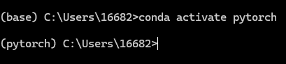

# Pytorch

# 一、前置条件

1. anaconda的安装

2. 通过anaconda安装构建出不同的环境，为后续不同的代码复现场景做准备。



- 此处若太慢，可以在base环境配置mamba，提升pytorch和后续更新速度

- 连接见:https://github\.com/mamba\-org/micromamba\-releases/releases/latest

- 下载对应版本的micromamba\.exe文件即可

- 最后将其配置到环境变量中

3. 在pytorch环境下配置jupyter noterbook

# 二、两大法宝函数

- `dir()`函数，能让我们知道工具箱以及工具箱中的分隔区有什么东西。

```Python
dir(pytorch)
```

- `help()`函数，能让我们知道每个工具是如何使用的，工具的使用方法。

```Python
help(pytorch.3)
```

___
# 小土堆pytorch

## 1\.Dataset\(从垃圾中发现可回收垃圾\)

##### （1）定义

提供一种方式去获取数据及其label:

- 获取每一个数据及其label

- 告诉我们总共有多少的数据

##### （2）实验过程——Dataset类代码实战！！！

1. 首先在Pycharm中配置python解释器（pytorch环境）


2. 随后在项目中输入代码

```Python
from torch.utils.data import Dataset
#此时使用jupyter中使用help(Dataset)查看作用,也可以ctrl+左键
```


3. 下载数据集蚂蚁蜜蜂
	详细代码见`learning_code/pytorch`


## 2\.Dataloader\(打包\)

为网络提供不同的数据形式 
___
# 黑马教程

## 一、张量

### 1、定义


### 2、创建

```Python
# 1.定义函数，演示：torch.tensor根据指定数据创建张量
def dm01():
    #场景1: 标量张量
    t1 = torch.tensor(10)
    print(f"type = {t1.type()},t1 = {t1}")
    print('-'*30)

    #场景2: 二维张量
    data1 = [[1,2,3],[4,5,6]]
    t2 = torch.tensor(data1)
    print(f"type = {t2.type()},t2 = {t2}")
    print('-'*30)

    #场景3: 三维张量
    data2=np.array(1,10,size(2,3))
    t3 = torch.tensor(data2)
    print(f"type = {t3.type()},t3 = {t3}")
    print('-'*30)
```

但在场景3中有报错

